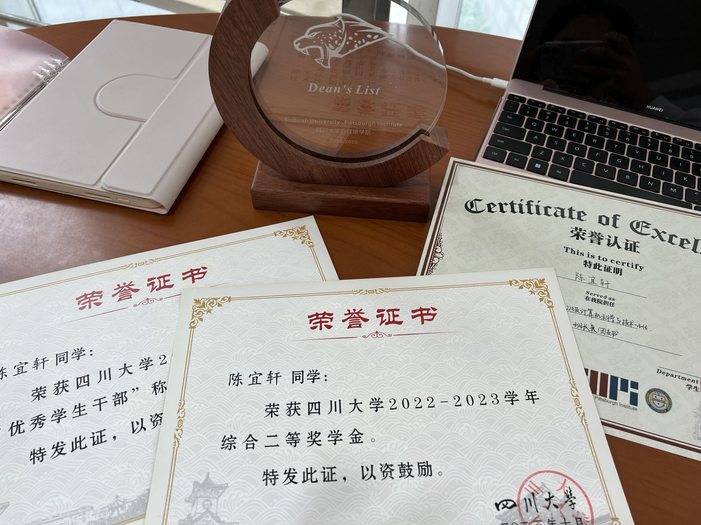

# 🏅 Awards & Achievements

Over the past few years, I have been fortunate to receive several academic and leadership recognitions that reflect my dedication and growth as a student and professional.

---

## 📘 Academic Excellence

- **First-Class Academic Scholarship**  
  *Sichuan University – Pittsburgh Institute, 2022–2023*  
  Awarded for maintaining top GPA among the class.

- **Dean’s List**  
  *University of Pittsburgh, Fall 2024*  
  Recognized for outstanding academic performance.

---

## 🌟 Leadership & Service

- **Excellent Student Leader Award**  
  *Sichuan University, 2023*  
  Honored for exceptional service as Class Representative and student organizer.

- **Peer Academic Advisor (China)**  
  *Sichuan University, 2023*  
  Provided one-on-one support for incoming CS freshmen on academics, course planning, and campus life.

---

## 🖼️ Certificates & Visuals

Below is a sample of one of the award certificates received:

---

> These recognitions are not only milestones but also motivation to continue learning and contributing meaningfully to my academic and professional communities.
